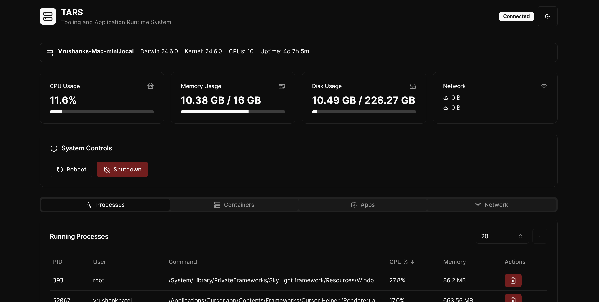

<div align="center">

# TARS — Tooling and Application Runtime System

[](#)
[](#)
[](#)
[](#)
[](#)
[](#)
[](#)


<br/>



</div>

## What is TARS?

TARS is a lightweight, privacy‑first, Umbrel‑like runtime for managing your server and self‑hosted apps. It focuses on running everything in Docker, keeping your system clean, fast, and easy to control — with a modern UI, real‑time updates, and zero fuss.

## Core Principles

- Fast and responsive (no junk, minimal overhead)
- Private by default (runs locally; no cloud required)
- Docker‑first architecture (apps as containers)
- Real‑time control with WebSockets (no polling storms)
- Pragmatic UX (quick actions, meaningful feedback)

## Features

- Containers
  - List, start, stop, restart Docker containers (running and exited)
  - Tail container logs (configurable tail with follow)
  - Health, status, image, and ports display
- Processes
  - Live process table with sorting and adjustable row count
  - Kill process action with confirmation toast
- System
  - Host info (OS, kernel, uptime, CPU, memory)
  - Metrics cards (CPU, memory, disk) with periodic refresh
- Network
  - Total sent/received counters
  - Per‑process activity overview (connections and bytes where supported)
- Power controls
  - Reboot and shutdown hooks with graceful container stop

## High‑Level Architecture

- Backend: FastAPI (Python) serving REST endpoints for system/power and a WebSocket endpoint for realtime data (processes, containers, logs, network)
- Frontend: React + Vite + Tailwind + shadcn/ui for a clean, accessible UI
- Runtime: Docker for isolation and reproducibility

```
React (TARS‑UI)  ⇄  FastAPI (REST + WebSocket)  ⇄  Linux utils + Docker CLI
```

## Quick Start

1) Backend (FastAPI)

```bash
# From project root
python3 -m venv venv
source venv/bin/activate
pip install -r requirements.txt
./start_backend.sh  # or: uvicorn app:app --host 0.0.0.0 --port 8000
```

2) Frontend (TARS‑UI)

```bash
cd TARS-UI
npm ci
npm run build
cd ..
cp -r TARS-UI/dist/* ui/
```

Open the UI at: http://localhost:8000/ui

## Development

Backend dev:

```bash
source venv/bin/activate
uvicorn app:app --reload --host 0.0.0.0 --port 8000
```

Frontend dev:

```bash
cd TARS-UI
npm i
npm run dev
```

## Project Layout (excerpt)

```
TARS/
├─ app.py                  # FastAPI entrypoint
├─ src/                    # Backend source (APIs, utils, schemas)
├─ ui/                     # Served static UI bundle (built artifacts)
├─ TARS-UI/                # React app source
└─ apps/                   # App bundles/docker-compose definitions
```

## Roadmap Ideas

- App store‑like UX for curated stacks (media, backup, AI, etc.)
- Fine‑grained container resource controls
- Notifications and audit log
- Backup/restore workflows

## Security & Privacy

TARS is designed to run locally on your hardware. No external telemetry is sent. Use CORS/hosts restrictions and reverse proxies as needed for your environment.

## License

MIT — do what’s right and contribute back fixes and improvements.